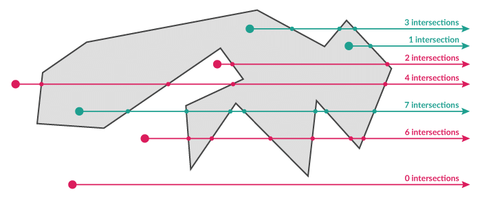
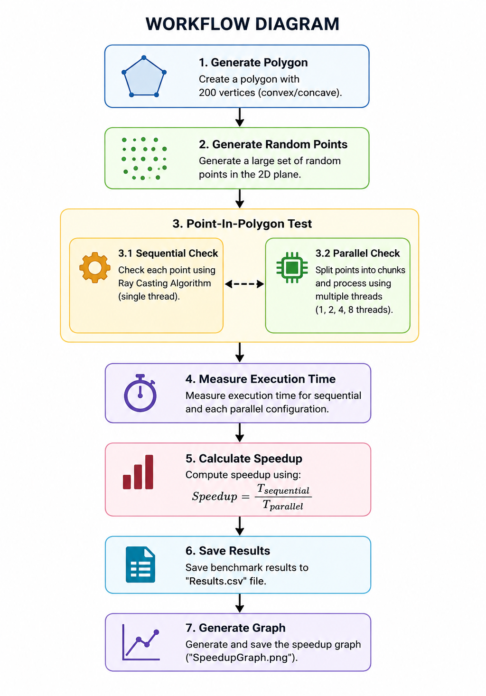
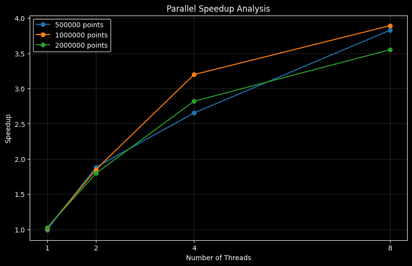

<h1 align="center">Parallel Point In Polygon Detection</h1>

<p align="center">
Parallel point-in-polygon detection using Java multithreading, performance benchmarking, and automatic speedup visualization.
</p>

<p align="center">
  
  
  
  
  
  
</p>

---

## Project Overview

This project solves the **Point In Polygon (PIP)** problem with a Java-based
parallel programming approach.

Given:

- a polygon represented by ordered `(x, y)` vertices
- a large list of test points

the program determines how many points are inside the polygon. It compares a
single-threaded sequential solution with a parallel solution implemented with
`ExecutorService`, `Callable`, and `Future`.

The implementation supports both convex and concave polygons. Points located on
a polygon edge or vertex are treated as inside.

---

## Problem Definition

The Point In Polygon problem determines whether a point lies inside, outside, or
on the boundary of a polygon.

This project uses the **Ray Casting Algorithm**. A horizontal ray is extended
from the test point to the right side of the plane, and polygon edge
intersections are counted.

### Rule

- Odd number of intersections: inside
- Even number of intersections: outside
- Point on an edge or vertex: inside



---

## Technologies Used

| Technology | Purpose |
|-----------|---------|
| Java | Main implementation |
| ExecutorService | Parallel task execution |
| Callable and Future | Worker result collection |
| Python | Graph generation |
| Pandas | CSV processing |
| Matplotlib | Speedup visualization |

---

## Project Structure

```text
ParallelPointInPolygon/
|-- Main.java
|-- Point.java
|-- Polygon.java
|-- PointInPolygon.java
|-- WorkerTask.java
|-- Benchmark.java
|-- BenchmarkConfig.java
|-- BenchmarkResult.java
|-- BenchmarkRunner.java
|-- CsvResultWriter.java
|-- DataGenerator.java
|-- ValidationTest.java
|-- PlotResults.py
|-- README.md
|-- LICENSE
|-- assets/
|   `-- screenshots/
|       |-- algorithm-workflow.png
|       |-- performance-graph.png
|       `-- ray-casting.png
|
`-- Results/
    |-- Results.csv
    `-- SpeedupGraph.png
```

---

## Main Components

| File | Responsibility |
|------|----------------|
| `Main.java` | Starts the benchmark workflow and graph generation |
| `Point.java` | Immutable point model |
| `Polygon.java` | Immutable polygon vertex container |
| `PointInPolygon.java` | Ray Casting implementation with boundary handling |
| `WorkerTask.java` | Parallel worker task for a point chunk |
| `BenchmarkRunner.java` | Sequential and parallel execution logic |
| `BenchmarkConfig.java` | Benchmark parameters |
| `BenchmarkResult.java` | Benchmark result model |
| `CsvResultWriter.java` | CSV output writer |
| `DataGenerator.java` | Random point and polygon generation |
| `ValidationTest.java` | Framework-free correctness checks |
| `PlotResults.py` | Speedup graph generator |

---

## Algorithm Workflow



---

## Polygon Generation

The benchmark uses a circular convex polygon with 200 vertices to create a
heavier computational workload.

```text
x = r * cos(theta) + r
y = r * sin(theta) + r
```

where:

- `r = 5`
- `vertex count = 200`

Concave polygon behavior is verified separately in `ValidationTest.java`.

---

## Parallelization Strategy

The project uses data parallelism. The point list is divided into chunks, and
each worker checks one chunk independently.

```text
All points
   |
   v
Split into chunks by thread count
   |
   v
Process each chunk in a worker task
   |
   v
Merge partial inside counts
```

The worker tasks do not share mutable state. Each task returns only its local
inside count, and the main benchmark runner sums the partial results.

```java
ExecutorService executor = Executors.newFixedThreadPool(threadCount);
```

The executor is shut down after each parallel run.

---

## Benchmark Methodology

Benchmark configuration:

- Point sizes: `500000`, `1000000`, `2000000`
- Thread counts: `1`, `2`, `4`, `8`
- Polygon vertices: `200`
- Warm-up iterations: `1`
- Measurement runs per configuration: `3`
- Random seed: fixed for reproducible input data

The benchmark measures:

- average sequential execution time
- average parallel execution time
- inside point count
- speedup

Speedup is calculated as:

```text
Speedup = Average Sequential Time / Average Parallel Time
```

The sequential and parallel inside counts are checked for equality. If a
parallel result does not match the sequential result, the benchmark fails.

---

## Benchmark Results

The following values were generated from `Results/Results.csv`.

| Points | Threads | Sequential Time (ms) | Parallel Time (ms) | Inside Count | Speedup |
|--------|---------|----------------------|--------------------|--------------|---------|
| 500000 | 1 | 289.188 | 291.079 | 392433 | 0.99 |
| 500000 | 2 | 289.188 | 153.520 | 392433 | 1.88 |
| 500000 | 4 | 289.188 | 108.981 | 392433 | 2.65 |
| 500000 | 8 | 289.188 | 75.545 | 392433 | 3.83 |
| 1000000 | 1 | 589.595 | 581.261 | 784968 | 1.01 |
| 1000000 | 2 | 589.595 | 318.613 | 784968 | 1.85 |
| 1000000 | 4 | 589.595 | 184.371 | 784968 | 3.20 |
| 1000000 | 8 | 589.595 | 151.475 | 784968 | 3.89 |
| 2000000 | 1 | 1169.686 | 1143.315 | 1570954 | 1.02 |
| 2000000 | 2 | 1169.686 | 650.962 | 1570954 | 1.80 |
| 2000000 | 4 | 1169.686 | 414.822 | 1570954 | 2.82 |
| 2000000 | 8 | 1169.686 | 329.411 | 1570954 | 3.55 |

---

## Performance Graph



Expected observations:

- Parallel execution improves performance as thread count increases.
- A one-thread parallel run may be slower than the direct sequential version
  because it includes executor and task management overhead.
- Speedup does not grow perfectly linearly because of scheduling overhead,
  worker creation cost, CPU limits, and memory access effects.

---

## Validation Cases

`ValidationTest.java` checks the correctness of the algorithm without requiring
JUnit or any external Java testing framework.

Covered cases:

- Convex polygon inside point
- Convex polygon outside point
- Concave polygon inside point
- Concave polygon outside point
- Point in a concave indentation
- Point on an edge
- Point on a vertex
- Sequential and parallel result equality

---

## How to Run

Compile all Java files:

```bash
javac *.java
```

Run validation tests:

```bash
java ValidationTest
```

Run the benchmark:

```bash
java Main
```

Generate the graph manually if needed:

```bash
python PlotResults.py
```

After execution, the generated outputs are:

```text
Results/
|-- Results.csv
`-- SpeedupGraph.png
```

---

## Sample Console Output

```text
Testing with 1000000 points
Sequential -> Inside: 784968 | Average Time: 603.240 ms
1 Threads -> Inside: 784968 | Average Time: 564.295 ms | Speedup: 1.07
2 Threads -> Inside: 784968 | Average Time: 299.171 ms | Speedup: 2.02
4 Threads -> Inside: 784968 | Average Time: 216.367 ms | Speedup: 2.79
8 Threads -> Inside: 784968 | Average Time: 149.372 ms | Speedup: 4.04
```

---

## Limitations and Future Work

- The benchmark uses a fixed generated polygon for the main performance test.
- More polygon shapes and vertex counts can be tested for deeper analysis.
- JVM microbenchmarking could be improved further with a dedicated framework
  such as JMH, but that is intentionally avoided to keep the project simple.
- GPU-based or spatial-index-based approaches could be explored as future work.

---

## License

This project is licensed under the MIT License. See the `LICENSE` file for
details.

---

## Author

**A. Furkan ÖCEL**

---

## License

This project is licensed under the terms included in the repository's `LICENSE` file.
